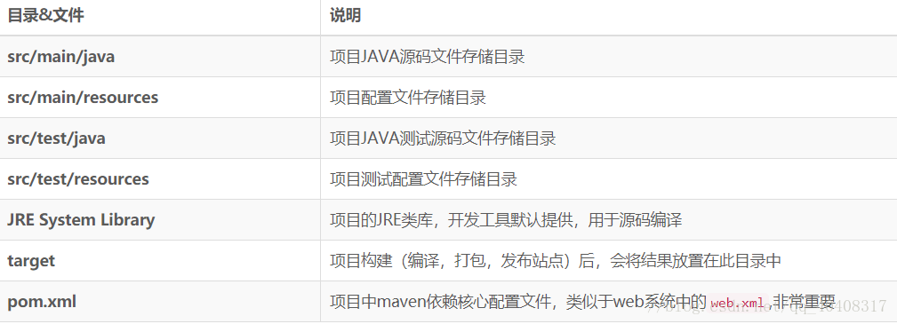

# JAVA-SSM框架
[参考这个学习网站](http://how2j.cn/stage/25.html)

### 工具和中间件
**Maven**：Maven 是专门用于构建和管理Java相关项目的工具。
一、主要用处一：相同的项目结构 ，1.有一个pom.xml 用于维护当前项目都用了哪些jar包；2. 所有的java代码都放在 src/main/java 下面；3. 所有的测试代码都放在src/test/java 下面。
二、主要用处二：统一维护jar包，比如说有3个Java 项目，这些项目都不是maven风格。那么这3个项目，就会各自维护一套jar包。 而其中有些jar包是相同的。而maven风格的项目，首先把所有的jar包都放在"仓库“ 里，然后哪个项目需要用到这个jar包，只需要给出jar包的名称和版本号就行了。 这样jar包就实现了共享。

**SSM（Spring + SpringMVC + Mybatis）框架并模拟搭建天猫购物网站**

* 效果一览：https://how2j.cn/tmall/

### 前台页面
第一类：登录页、注册页
第二类：首页、分类页、查询页、产品详情页
第三类：购物车页、结算页（收货地址）、支付页、订单页（所有订单，待付款，待发货，待评价）
具体见：需求分析交互->前台需求分析
**亮点添加（没有做）**
1、登录页面加入动态验证码
2、支付页面看看能够调用支付宝的API 

### 后台功能
分类管理（图片，属性，产品，名称）：
用户管理：
订单管理（发货）：

