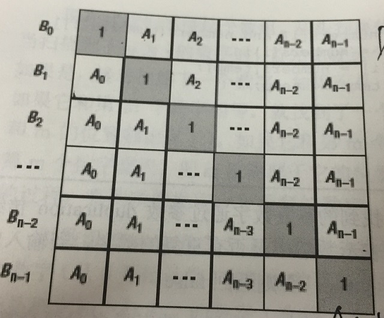

# Java-算法之数组

* 多种解法时，请永远记住最优的，因为一般只考最优的解法。

1. <a href="#最大子序列和">最大子序列和</a>
2. <a href="#摩尔投票法">摩尔投票法</a>
3. <a href="#盛水最多的容器">盛水最多的容器</a>

快捷键：Ctrl + Home 快速回到页面顶端查看目录，点击锚点，快速定位到算法。
****

**LEETCODE：最大子序列和**<a name="最大子序列和"></a>
题目概述：找到一个具有最大和的连续子数组（子数组最少包含一个元素）
解题思路：连续累加，小于零重置为零，大于零和最大值比较，记录最大值。
测试用例：面试问清楚是否为整数数组？空返回什么？会不会超出int的精度？

```java
public int maxSubArray(int[] nums) {
 //面试需要考虑空的情况，但是空返回什么呢，可能还需要给标志位。
    int max = nums[0];
    int temp = 0;
    for(int x : nums){
        temp += x;
        if(temp > max)
            max = temp;
        if(temp < 0)
            temp = 0;
    }
    return max;
}
```
**LEETCODE：摩尔投票法** <a name="摩尔投票法"></a>
题目概述：给出一个数组，其中存在一个出现次数大于该数组长度一半的值。
解题思路：记录遇到数字的数量，如果数字与之前相同加一，否则减一，数量为零时，重置众数。
测试用例：空咋办，返回啥？是整数数组么？

```java
public int majorityElement(int[] nums) {
    int mode = 0, count = 0;
    for(int x : nums){
        if(count == 0)
            mode = x;
        if(mode == x)
            count++;
        else
            count--;
    }
    return mode;
}
```

**LEETCODE：盛水最多的容器**<a name="盛水最多的容器"></a>
题目概述：一个数组，每个数字代表高度，求两个数字之间所能装的最大水量。
解题思路：指针指向两端，【较低的一端高度 * 指针两端的长度】与最大值比较，移动较低一端的指针，往中间移，直到两指针相遇。
优化：在移动的过程中，判断，如果高度比【较低一端】还小，那么一定不符合要求，可继续移动，不用比较。
```java
public int maxArea(int[] height) {
    if(height == null || height.length <= 1)
        return 0;
    int left = 0, right = height.length-1;
    int mArea = 0;
    while(left < right){
        if(height[left] < height[right]){
            mArea = Math.max(mArea, (right-left)*height[left]);
            int temp = left + 1;
            while(temp < right && height[temp] <= height[left])
                temp++;
            left = temp;
        }else{
            mArea = Math.max(mArea, (right-left)*height[right]);
            int temp = right - 1;
            while(temp > left && height[temp] <= height[right])
                temp--;
            right = temp;
        }
    }
    return mArea;
}
```


**剑指offer：二维数组中的查找**<a name="xxxx"></a>
题目概述：在一个二维数组中，每一行都按照从左到右递增的顺序排序，每一列都按照从上到下递增的顺序排序，判断数组中是否含有该整数。
解题思路：从左下角往上走，遇到比它小的值，往右走，然后重复上右上右直到结束
进阶：可以用二分查找加快这个进度
测试用例：空，有，没有
```java
public boolean Find(int target, int [][] array) {
    if(array == null || array.length == 0)
        return false;
    int row = array.length-1, col = 0;
    while(row >= 0 && col <= array[0].length-1){
        if(array[row][col] == target)
            return true;
        else if(array[row][col] > target)
            row--;
        else
            col++;
    }
    return false;
}

//为了这一点点优化，写了我好久啊~
public class Solution {
    public int binarySearchRows(int[][] array, int left, int right,int col,int target){
//寻找第一个大于等于target的值，如果等于则在该行，否则肯定在上一行，可能超出索引。
        while(left<right){
            int mid = (left+right)/2;
            if(array[mid][col] >= target)
                right = mid;
            else
                left = mid+1;
        }
        if(array[left][col] == target)
            return left;
        return left-1;
    }

    public int binarySearchCols(int[][] array, int left, int right,int row,int target){
//寻找第一个大于等于target的值，如果这行没有，那么返回一个超出索引的值。
        while(left<right){
            int mid = (left+right)/2;
            if(array[row][mid] >= target)
                right = mid;
            else
                left = mid+1;
        }
        if(array[row][left] >= target)
            return left;
        return left+1;
    }

    public boolean Find(int target, int [][] array) {
        if(array == null || array.length == 0)
            return false;
        int row = array.length-1, col = 0;
        while(row >= 0 && col <= array[0].length-1){
            if(array[row][col] == target)
                return true;
            else if(array[row][col] > target)
                row = binarySearchRows(array,0,row,col,target);
            else
                col = binarySearchCols(array,col,array[0].length-1,row,target);
        }
        return false;
    }
}
```

**剑指offer：构建乘积数组**<a name="xxxx"></a>
题目概述：给定一个数组A[0,1,...,n-1],请构建一个数组B[0,1,...,n-1],其中B中的元素B[i]=A[0] * A[1] * ... * A[i-1] * A[i+1] * ... * A[n-1]。不能使用除法。
解题思路：巧妙利用数组错位相乘。下三角用连乘可以很容求得，上三角，从下向上也是连乘。
测试用例：空，长度为 0


```java
public int[] multiply(int[] A) {
    if(A == null || A.length == 0)
        return new int[]{};
    int length = A.length;
    int[] B = new int[length];
    B[0] = 1;
    for(int i=1; i<length; i++){
        B[i] = B[i-1] * A[i-1];
    }
    int temp = 1;
    for(int i=length-2; i>=0; i--){
        temp *= A[i+1];
        B[i] *= temp;
    }
    return B;
}
```

**剑指offer：原地合并两个排序数组，不使用额外空间**<a name="xxxx"></a>
题目概述：给定两个排序数组，数组1的空间足够大，将两个数组合并。
解题思路：从后面开始移动，逆向思维。
```java
while(oneLen >= 0 || twoLen >= 0){
    int one = (oneLen >= 0) ? arrayOne[oneLen] : 0;
    int two = (twoLen >= 0) ? arrayTwo[twoLen] : 0;
    if(one > two){
        arrayTwo[index] = one;
        oneLen--;
        index--;
    }else{
        arrayTwo[index] = two;
        twoLen--;
        index--;
    }
}
```